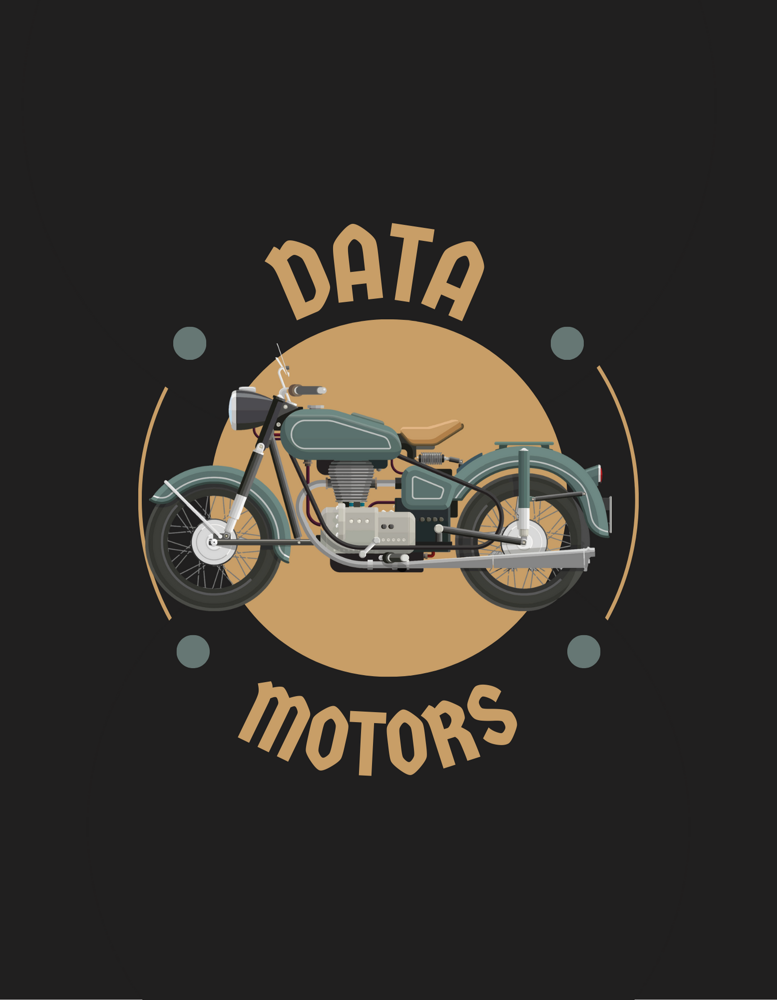

# Data-Driven Decision Making at Data Motors
<H1 align="center">
  
</H1>
<H3 align ="right"> This project was made by Pablo Gomes de Miranda.</H3>

## Overview:
Data Motors is a motorcycle resale company. Its business model is to resell used motorcycles. With the rising value of used vehicles, Data Motors, as it is known, wants to expand its business. We were hired as a data scientist by Data Motors to help them find the best motorcycles for resale. 

**Disclaimer**: The company "Data Motors", the CEO, and these questions are completely fictitious and serve only for the purpose of developing this project.

##### ps.: The goal of this project is to simply show basic proficiency in the Python language and code versioning using Git and Github.

##### ps2.: The data, as well as their description, was taken from the **Kaggle** database [Motorcycle Dataset](https://www.kaggle.com/datasets/nehalbirla/motorcycle-dataset).
## Final Product:
We will answer the CEO's rounds of questions via email, sending a file in .xlsx format at the end with suggestions on which motorcycles to buy. We will also make the information available through API, including graphs and a download button for the same .xlsx file.

## Tools Used:
- Python 3.10.8;
- VS Code;
- Jupyter Notebook;
- Git and Github;
- Streamlit Cloud.

# 1. Business Problem:
The CEO of Data Motors company hired us as a data scientist because it wants to increase its profit by buying and reselling the best motorcycles available within the database that the company acquired through a market study.

## Objectives:
1. Answer all the questions made by Data Motors' CEO.
2. Suggest the purchase of motorcycles that meet all the company's standards (question 7, third round)
3. Provide all information through API

# 2. Business Assumptions
The database is based on an Indian new and used motorcycle resale website, with values negotiated in Indian Rupees. However, we have noted the values in US dollars.
## Features
| Feature | Description |
| :----- | --------: |
| name | Motorcycle manufacturer and model |
| selling_price | Selling price |
| year | Motorcycle year of manufacture |
| seller_type | Individual, personal, seller or reseller |
| owner | If the motorcyle had one, two, three of four owners |
| km_driven | Number of kilometers driven on the motorcycle |
| ex_showroom_price | Motorcycle price without insurance and registration fees |

# 3. Solution Strategy
My strategy to solve this challenge was:
**Step 01. Data Description:** exploring the elements of the database (shape, data type and NA check).

**Step 02. Feature Engineering:** creating new features that could help to answer the questions made by the CEO of Data Motors. 

**Step 03. Rounds of Questions:**

First Round of Questions:

1. How many motorcycles do we have inside the database?
2. What is the year of the oldest motorcycle in the database?
3. What is the year of the newest motorcycle in the database?
4. What is the value of the most expensive motorcycle in the database?
5. What is the odometer value of the bike with the most mileage?
6. What is the odometer value of the bike with the lowest mileage?
7. According to our database, from all of the motorcycles being displayed in a Show Room, which one is the most expensive?
8. According to our database, from all of the motorcycles being displayed in a Show Room, which one is the less expensive?
9. How many motorcycles are being sold by their owners and how many are being sold by resellers?
10. What is the average price of the motorcycles in the database?
11. What is the average year of the motorcycles in the database?
12. What is the average mileage of the motorcycles in the database?
13. How many motorcycles in the database had only one owner?
14. Are the motorcycles with the highest mileage the cheapest motorcycles in the Dataset?

Second Round of Questions:

1. Are motorcycles that only had 1 owner more expensive on average than motorcycles that have had more owners?
2. Are the bikes that have had more owners the bikes that have higher average mileage than the bikes that have had fewer owners?
3. Are the bikes that have had more owners the oldest bikes on the average?
4. Are motorcycles that are sold by dealers, most expensive motorcycles on average? More than motorcycles sold by their owners?
5. Of the manufacturers, which has the largest number of motorcycles registered in the database?

Third Round of Questions:

1. Adjust the feature `name` so that it only has the name of the motorcycle.
2. Which of the manufacturers has the highest average price of their motorcycles?
3. Which manufacturer has the bike with the most mileage?
4. Which manufacturer has the oldest motorcycle?
5. Is the manufacturer that has the most expensive bike in the Dataset, also the manufacturer that has the fewest registered bikes?
6. Which manufacturer has the smallest variation in sales value?
7. Which Motorcycles should be acquired?
- Take into account that we want bikes with a maximum of 3 years of use; 
- A maximum of 40,000 kilometers of mileage; 
- That are from one owner only;
- That are being sold by individuals (not reseller), and that have an intended sale value lower than the showroom value. 

# 7. Business Results
We were able to detect 91 motorcycles within the standard requested by the CEO of Data Motors that can be purchased at a reasonable price and resold at a profit.

# 8. Conclusions
We exported an .xlsx file with the motorcycle purchase suggestions, created an API, and put the model into production using the Streamlit Cloud service. In addition, we answered all the CEO's questions with graphs whenever this helped us to better understand the data we had access to.

# 9. Lessons Learned
This was an excellent exercise to understand the basics of Python, practice data manipulation, and understand the libraries of this programming language. In addition, for this project we also exercised code versioning, both in local and remote repositories with Git and Github.

# 10. Next Steps to Improve
For this to be a better Data Analysis project, it needs a more solid Business Problem, where we can calculate the return on revenue for the company that is hiring us, thus demonstrating the benefits of Data Analysis. Beyond that, much can be done: we can start by creating hypotheses, further explore the data for insights, and from there evolve to the study with Machine Learning models, however, this will only be possible, again, with a more solid Business Problem.